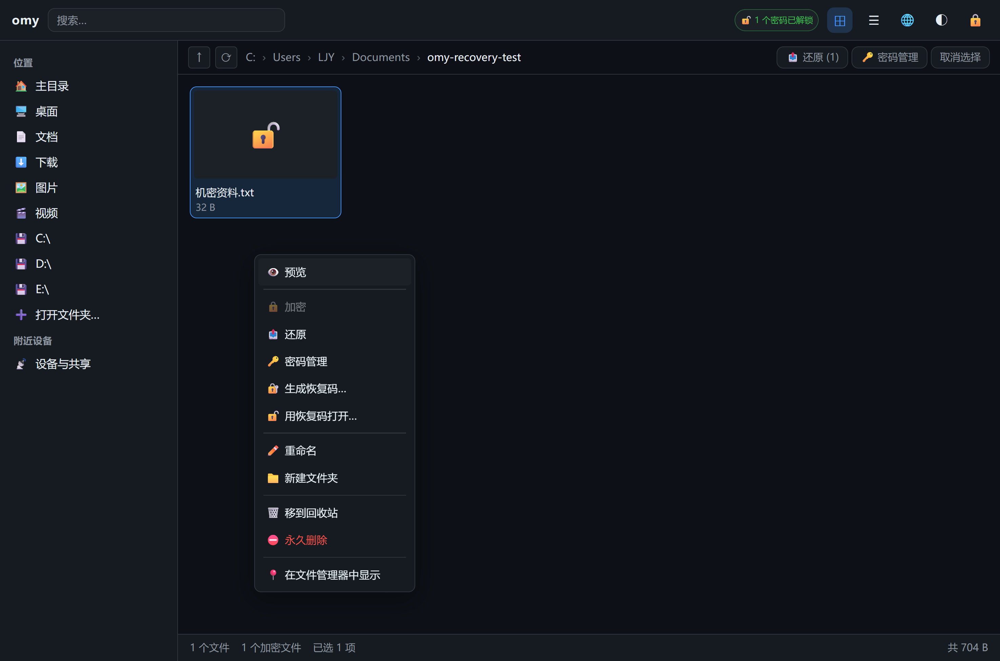
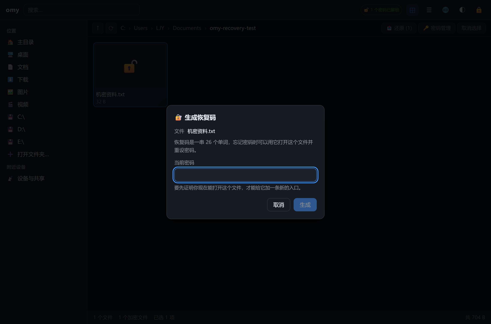
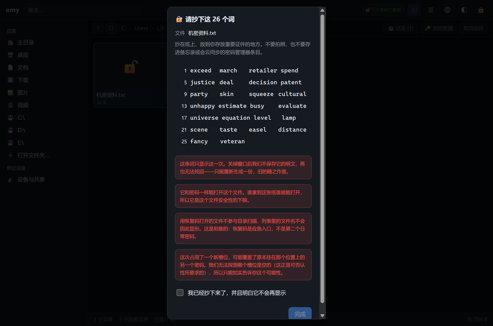
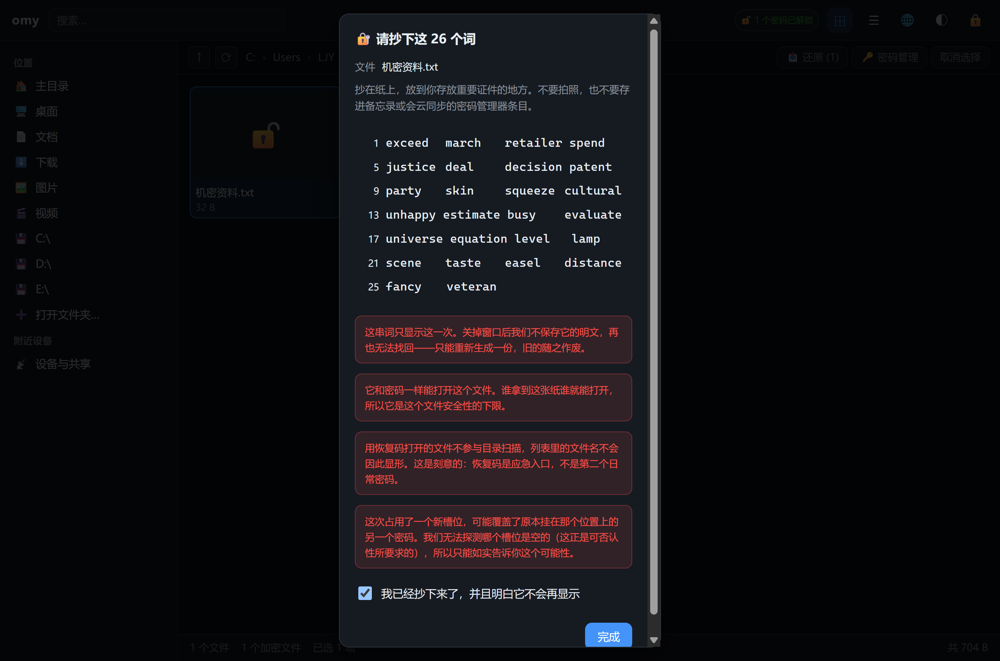
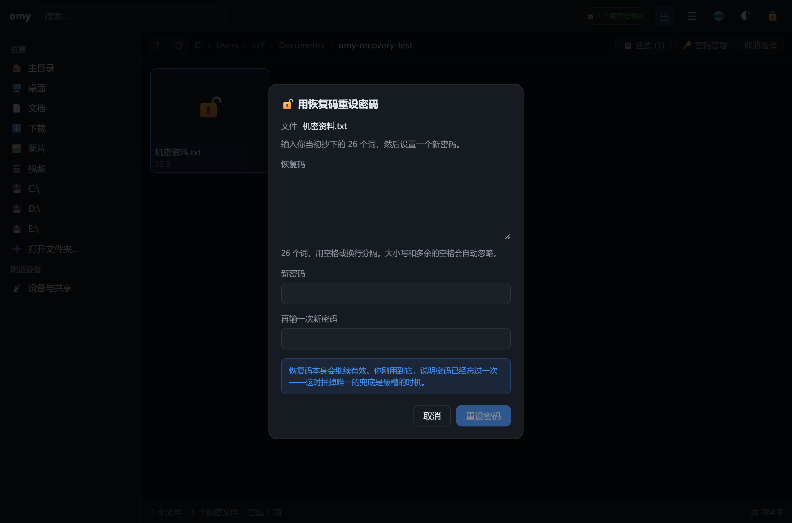
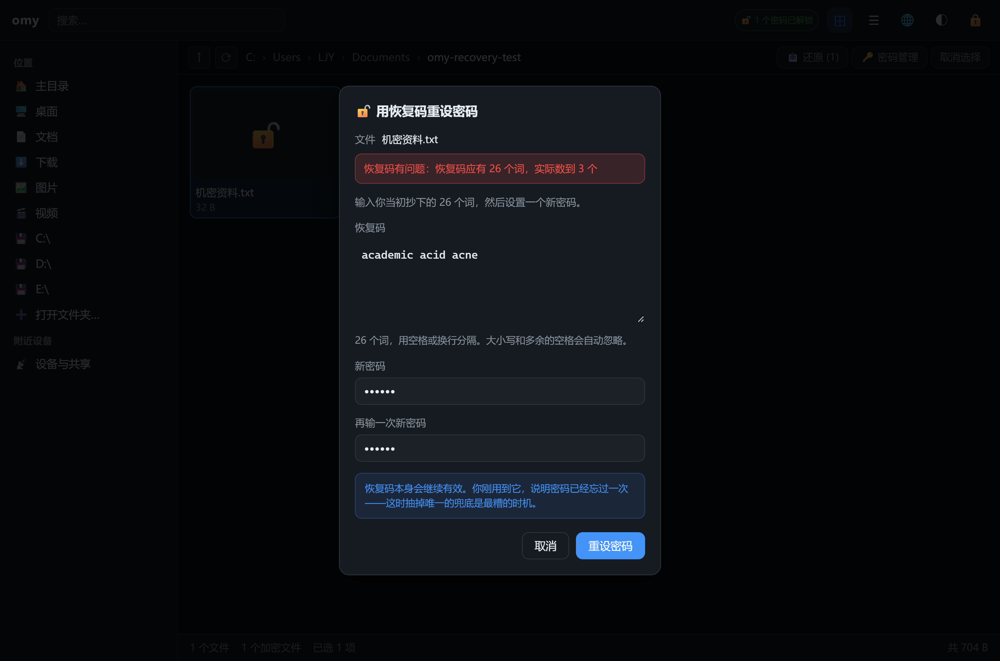
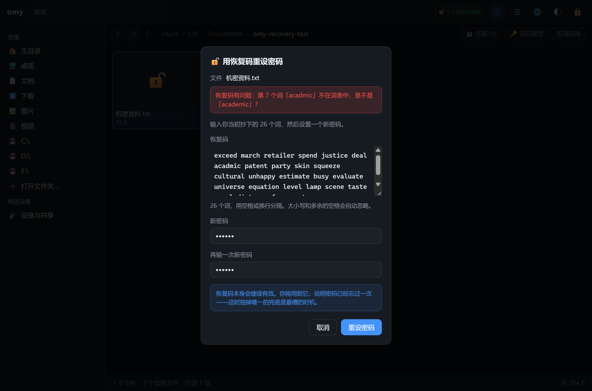
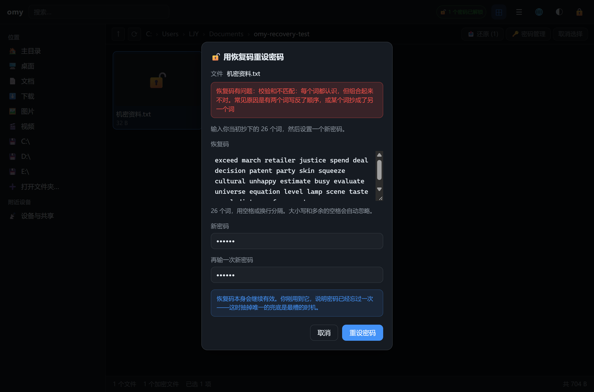
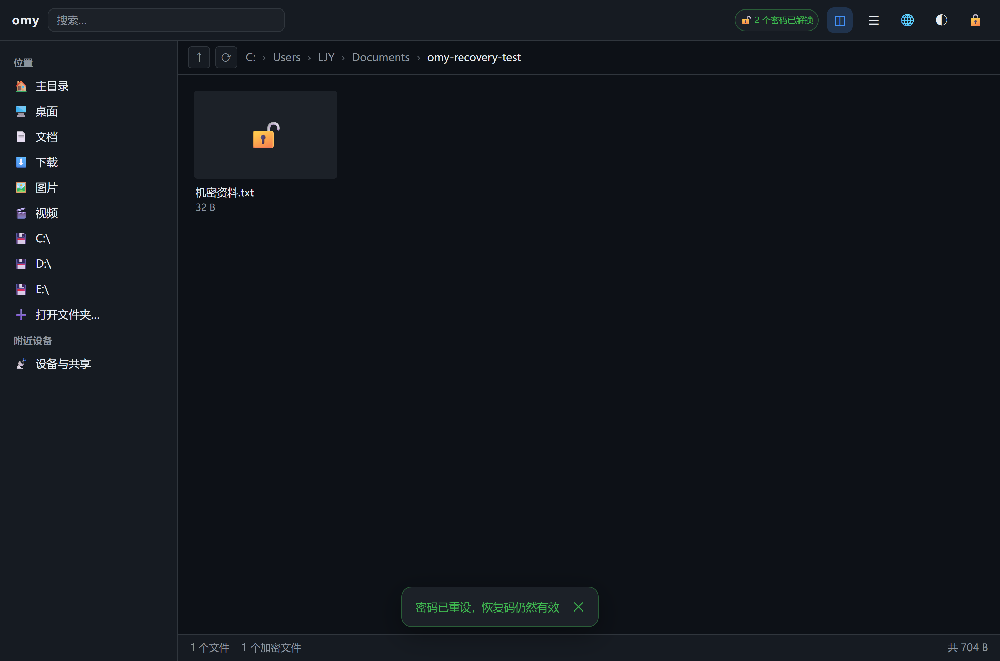

# omy 恢复码界面

本文记录 GUI 侧恢复码功能的设计取舍与实际效果。截图全部来自
`spikes/verify-recovery-gui.ps1` 的真实运行，不是手工摆拍。

## 一、它解决什么问题

在此之前，omy 的密码忘了就是真的没救——这是设计使然（没有后门、没有主
密钥），但对个人用户来说太脆。恢复码给出一条**可控的**退路：26 个单词，
抄在纸上，忘记密码时用它打开文件并重设密码。

它不是第二个日常密码。两者的区别：

| | 密码 | 恢复码 |
|---|---|---|
| 由谁决定 | 用户自己想 | 随机生成，256 位熵 |
| 记在哪 | 脑子里 | 纸上 |
| 用途 | 日常打开 | 密码忘了才用 |
| 参与目录扫描 | 是（文件名显形） | 否 |
| 能改吗 | 能 | 只能重新生成，旧的作废 |

「不参与目录扫描」是刻意的：恢复码是应急入口，不该让人养成日常拿它开
文件的习惯——每用一次就是一次暴露机会。

## 二、两个入口，两种心智

恢复码没有并进已有的「密码管理」对话框。那个对话框回答的是「我怎么让某个
密码不再有效」，四个操作共享同一套输入（当前密码 + 新密码）。恢复码是另外
两件事：

- **生成**：一次性展示 26 个词，用户要抄下来，此后再也看不到。这里根本
  没有「新密码」这个概念。
- **使用**：密码已经忘了，输入那 26 个词换一个新密码。这里根本没有
  「当前密码」。

硬塞进去会让那个对话框变成一堆互斥分支，而用户来的时候本来就很清楚自己
要哪一个。

右键菜单里是两个独立项：

### 一个容易写错的判据

两个菜单项的可用条件**不同**，而且方向相反：

- 「生成恢复码」要求文件**已解锁**——你得先证明现在能打开它，才能给它加
  一条新的入口。
- 「用恢复码打开」**不要求**解锁——会用到它正是因为密码已经忘了。

照抄「密码管理」的判据（要求 unlocked）会让第二个菜单项只在文件已解锁时
才亮，而那时用户根本不需要它，真正需要的时候反而是灰的。

## 三、生成

先要当前密码：

然后一次性展示 26 个词：

几个刻意的选择：

**没有「复制」按钮。** 有的话，多数人会粘到某个笔记应用里——那是同步到
云端、进入搜索索引、留在剪贴板历史里的一份明文万能钥匙。只做分行编号
展示，引导抄在纸上。

**词用等宽字体。** 比例字体下 `rn` 和 `m`、`l` 和 `I` 在小字号里很难分辨，
而用户是照着屏幕往纸上抄，一个字母错了整串就废了。

**每行 4 个、带行号。** 排成一行没法抄，用户会数不清抄到哪了。行号还让
「第 7 个词有问题」这类提示能被真正用上。

**三条警告都在词的下面。** 放上面会被一长串词挤出视野。

**必须勾选「我已抄下」才能关闭：**

后端不保存恢复码明文，关掉这个框就真的没了。摩擦在这里是必要的——用户点
「完成」时必须已经意识到「这串东西不会再出现」。

### 词为什么能安全地回传给前端

CLI 的 `--json` 刻意**不**输出恢复码，因为那种输出常被重定向进文件或管道
进日志。而 GUI 这里走的是 Tauri IPC：内容只进 WebView 的内存，用于当场
显示，不落盘、不进任何日志。前端拿到后只显示、不存储——不写
localStorage，不留在超出对话框生命周期的状态里。

## 四、使用

输入框是 textarea 而不是单行 input：26 个词一行放不下，而用户是照着纸抄
进来的，需要能看见自己抄到哪了。

### 三种抄错，三种提示

校验和的职责是**区分「抄错了」和「拿错了」**——这两种处境的处置方式相反：
前者该回去核对纸条，后者该承认拿错了东西。而 26 个词里错一个，让用户从头
核对 26 遍是很糟的体验。所以解析失败分三种，各自指向不同的下一步：

**词数不对：**

**某个词不在词表里——能精确指出是第几个，并给出建议：**

这条提示之所以能精确到词，靠的是 SLIP-39 词表的一个性质：**前 4 个字母
全局唯一**。选它而不是 BIP-39 正是为了手抄场景。

**词序颠倒——每个词都认识，但组合不对：**

这条由 4 bit 校验和抓到。它有约 1/16 的漏网率，这是与抄写负担的取舍：
漏网时派生出的密钥也解不开文件，用户照样得到「打不开」，只是错过了
「第几个词可能有问题」这条更有用的提示。

### 成功之后

提示明确说「恢复码仍然有效」。这不是顺带一提——**用到恢复码就意味着密码
已经忘过一次**，这时抽掉唯一的兜底是最坏的时机。

大小写和多余空白会被归一化，抄的时候不必拘泥格式。

## 五、验证

`spikes/verify-recovery-gui.ps1`，28 项全部通过。

每一项都走真实界面：真的右键、真的点菜单、真的填词、真的提交。不用
`invoke` 直接调后端——那样验证的是后端，而后端上一轮已经验过了；这一轮
要回答的是「界面接对了没有」。

界面说成功不算数，脚本最后用 CLI 独立复核两件事：

- 界面设的新密码真的能解开，且明文与原文一致
- 旧密码真的已经失效

只信界面的话，一个只改了提示语却没真写盘的实现照样会「通过」。

变异测试见 `spikes/mutate-recovery-gui.ps1`，6 项全部被抓到。

### 变异测试抓出了一个真实的断言缺口

前 26 项断言写完时，有一个变异**存活**了：把 `generate_recovery` 的 `keep`
改成只含恢复码、并把 `OtherSlots::Carry` 换成 `Discard`——也就是让「生成
恢复码」顺手抹掉用户的日常密码。26 项全绿。

按惯例应该先问「这个变异是不是等于空操作」，但这次实测下来它真的改变了
行为。躲过断言的原因是探针的走向：生成恢复码之后，流程一路用恢复码重设
密码，全程不再碰原密码；最后 CLI 复核的又是「新密码能开、旧密码已失效」
——而旧密码本来就该失效。整条链里没有任何一处会问「原密码在生成恢复码
之后是否还活着」。

而那恰恰是这个功能最该保住的东西：**用户只是加了一条退路，不该因此丢掉
日常入口。**

补的断言是锁定会话后用原密码重新解锁，看文件名是否还能显形。补完之后
这个变异立刻被抓到。

## 六、过程中踩到的两个坑

记下来是因为它们都**极难从表象判断**。

### 前端是内嵌进二进制的

`tauri.conf.json` 的 `frontendDist` 指向 `dist`，release 构建会把整个前端
打进 exe。所以改了 `.vue` 只跑 `bun run build` 是不够的，必须再
`cargo build`。

这个坑的表现具有迷惑性：dist 确实是新的，前端确实构建成功了，但 GUI 显示
的仍是旧界面——**所有断言一起失败，看上去像功能完全没做**。当时的线索是
9 张截图字节数一模一样，说明画面根本没变过。

验证脚本现在会拿 exe 同时跟 `.rs` 和 `dist` 比，任一更新就拒绝运行。

### Vue 的 `:data-key` 不会渲染成 DOM 属性

探针需要按结构定位菜单项（不能按文字——「生成恢复码」和「用恢复码打开」
都含「恢复码」，文字匹配会点中错的那个）。加了 `:data-key="it.key"`，
结果读出来全是 `undefined`。

原因是 Vue 把 `data-key` 归一化成了保留的 `key` 特性用于列表 diff。换成
`data-mi` 就正常了。

**先查探针再改产品**：截图显示两个菜单项都在、都可用，说明产品没问题，
是这个属性名选错了。

### 一个变异写成了空操作，另一个是真缺口

这两种情况表现一样（变异存活），处理方式却完全相反，所以每次都要先问
「它真的改变了程序的可观察行为吗」。

**空操作的那个**：把 `generate` 的 `keep` 里的当前密码去掉。看着是「丢掉
密码」，但 `OtherSlots::Carry` 会把它从原来的槽位原样搬回来——当前密码本来
就在文件里，搬运正好复原了它。必须连 `Carry` 一起改成 `Discard` 才真的
改变了行为。

**真缺口的那个**：就是上面说的断言缺口，补断言解决。

## 七、还没做

- **树形加密目录**：每个文件各自挂槽，「整棵树共用一份恢复码还是各一份」
  还没定，所以菜单项对目录是灰的，后端也会如实拒绝。
- **批量补挂**：目前一次只给一个文件生成。已经加密过的一批文件想统一补上
  恢复码，还得一个个来。
